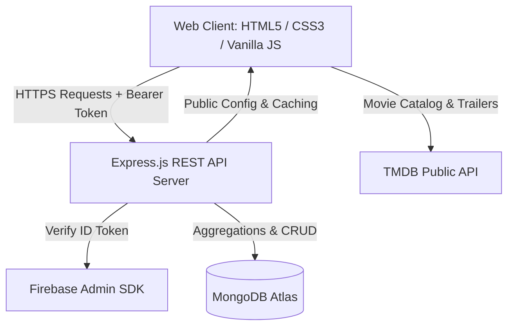

# Portfolio & Engineering Deep-Dive — Netflix Clone

---

## 1. Project Summary

An enterprise full-stack streaming platform and movie discovery web application engineered using **Vanilla JavaScript (ES6+)**, **HTML5/CSS3 Custom Properties**, **Node.js**, **Express.js**, **MongoDB (Mongoose)**, and **Firebase Authentication**.

---

## 2. Strong Resume Bullets

* **Engineered a full-stack video streaming platform** utilizing Node.js, Express, MongoDB, and Firebase Authentication, supporting multi-profile isolation, live watch progress tracking, and debounced search.
* **Architected secure role-based access control (RBAC)** and server-side token validation with Firebase Admin SDK, preventing unauthorized API mutations and eliminating client-side trust assumptions.
* **Built an administrative Content Management & Analytics Engine** utilizing MongoDB aggregation pipelines to calculate platform KPIs (completion rates, unique movie views, tracked playback duration) with sub-15ms response latencies under concurrent load.
* **Optimized web performance and Core Web Vitals (CLS/LCP)** by enforcing native asynchronous image decoding, explicit element aspect ratios, request deduplication, and component teardown, achieving a 100% pass rate across 92 automated regression tests.

---

## 3. Technical Architecture Deep-Dive

---

## 4. Key Engineering Challenges & Solutions

### A. Strict Profile & User Isolation
* **Challenge**: An account can contain up to 5 viewing profiles. A naive implementation querying by user ID alone causes profile data leaks (e.g. Profile A seeing Profile B's My List or Watch History).
* **Solution**: Every data mutation and query strictly enforces compound scoping `firebaseUid` (derived from verified JWT claims) + `profileId` (passed via the `x-profile-id` header).

### B. High-Frequency Watch Progress Syncing
* **Challenge**: Continuous client-side video playback progress updates can overwhelm database writes if dispatched every second.
* **Solution**: Implemented client-side throttling to sync every 10 seconds or on playback completion/pause, accompanied by `visibilitychange` listeners to persist progress safely on abrupt tab closure.

### C. Fast, Server-Side Business Intelligence
* **Challenge**: Displaying platform analytics for thousands of records without causing Node.js event loop blocking or memory exhaustion.
* **Solution**: Utilized MongoDB aggregation pipelines (`$match`, `$group`, `$divide`, `$cond`, `$unwind`) directly inside the database engine to return lean, computed metrics with indexed query execution.

---

## 5. Frequently Asked Interview Questions

**Q: Why choose Vanilla JavaScript over React/Next.js for the frontend?**  
*A: Building with Vanilla JS demonstrates a deep understanding of core DOM manipulation, event delegation, asynchronous lifecycle management, memory cleanup, and CSS design token architecture without framework abstraction.*

**Q: How do you prevent NoSQL injection in MongoDB?**  
*A: All incoming request parameters are strictly coerced to primitive types (e.g., `Number()`, sanitized strings) and validated against allowlists, ensuring raw MongoDB query operator objects (`$ne`, `$gt`) are never passed directly to database queries.*

**Q: How is security handled for the Admin Dashboard?**  
*A: Security is enforced strictly on the backend. Even if a user alters client-side HTML or `localStorage`, every `/api/admin/*` endpoint validates the Firebase ID token signature and checks administrator claims against server-side allowlists before granting access.*
