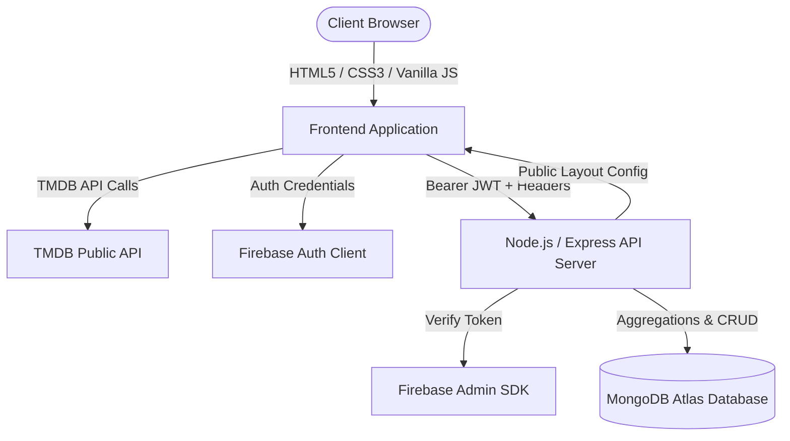

# Netflix Clone — Full-Stack Streaming Platform & Movie Discovery Engine

[](https://nodejs.org/)
[](LICENSE)
[](RELEASE.md)
[](PORTFOLIO.md)

An enterprise-grade, full-stack video streaming and movie discovery platform inspired by Netflix. Built with a cinematic **Vanilla JavaScript / CSS3** frontend, an authenticated **Node.js & Express REST API**, **MongoDB Atlas** database persistence, **Firebase Authentication**, and live **TMDB (The Movie Database)** catalog feeds.

---

## 1. Overview

The Netflix Clone demonstrates a scalable, production-ready streaming architecture engineered to solve real full-stack challenges:
* **Multi-Profile Isolation**: Enforces compound scoping (`firebaseUid` + `profileId`) across watchlists, viewing history, and recommendations.
* **Live Video Playback Engine**: Custom HTML5 streaming player with 10-second throttled progress persistence, completion heuristics (`progress / duration >= 0.9`), and Continue Watching synchronization.
* **Administrative Business Intelligence & Content Curation**: Real-time aggregate platform metrics (completion rates, unique movie views, tracked playback duration), headline hero selector, and append-only audit trail.
* **High-Performance Delivery**: Asynchronous image decoding, zero layout shift (CLS), request debouncing/cancellation via `AbortController`, and sub-15ms concurrent API latency.

---

## 2. Core Features

### 🎬 Public & Content Discovery
* **Dynamic Hero & Carousels**: Featured headline banner with backdrop preview and fluid horizontal carousels with hover-zoom micro-interactions.
* **Rich Content Intelligence**: Cast member credits (top 8), director extraction, spoken language resolution, and expandable synopses.
* **YouTube Trailer Integration**: Instant trailer streaming modal with automatic GPU/iframe decoder destruction on close.
* **Advanced Search & Genres**: Debounced search (300ms) with multi-category genre pills, deep linking (`browse.html?genre=28`), and browser history support.

### 👤 User Experience & Viewing Profiles
* **Firebase Authentication**: Email/Password & Google Sign-In with server-verified ID tokens.
* **Multi-Profile System**: Up to 5 personas per account with Kids content filter mode and custom avatar badges.
* **My List 2.0 (Personal Content Library)**: In-library search, status filters (`[ Not Started ]`, `[ In Progress ]`, `[ Completed ]`), multi-sort, and optimistic removal.
* **Personal Viewing Insights (`activity.html`)**: Profile-scoped watch statistics, factual highlight banner, recently watched carousel, and chronological activity timeline.

### 🛡️ Administration & Platform Analytics
* **Business Intelligence Dashboard (`admin.html`)**: Real-time aggregate KPI metrics calculated in MongoDB memory.
* **Content Management System**: Headline hero movie selector, section ordering/visibility toggles, and themed curated collection builder.
* **Append-Only Audit Trail**: Immutable logging of administrative mutations (`adminEmail`, `action`, `resource`, `timestamp`).

---

## 3. Technology Stack

| Layer | Technology | Purpose |
| :--- | :--- | :--- |
| **Frontend** | HTML5 / CSS3 / Vanilla JS (ES6+) | Component rendering, cinematic design system, DOM lifecycle |
| **Backend API** | Node.js / Express.js | RESTful routing, middleware security, data aggregation |
| **Database** | MongoDB (Mongoose ODM) | Document persistence, compound indexing, connection pooling |
| **Authentication** | Firebase Auth / Firebase Admin SDK | Client token dispatch and server-side JWT verification |
| **Catalog Data** | The Movie Database (TMDB) API | Movie metadata, posters, backdrops, and trailer feeds |
| **Security** | Helmet / express-rate-limit | HTTP security headers, CORS origin whitelisting, rate limiting |

---

## 4. System Architecture



---

## 5. Project Directory Structure

```text
NetflixClone/
├── index.html              # Main streaming homepage
├── browse.html             # Advanced search & genre exploration
├── watch.html              # HTML5 video player & streaming experience
├── activity.html           # Profile viewing insights & timeline
├── admin.html              # Admin dashboard, analytics & content curation
├── login.html              # User authentication login view
├── register.html           # User registration view
├── profiles.html           # Viewing profile selection & management
├── profile.html            # Profile edit view
├── settings.html           # Account & playback preferences
├── notifications.html      # User in-app notifications
├── DEPLOYMENT.md           # Production DevOps & deployment runbook
├── PORTFOLIO.md            # Technical deep-dive & interview guide
├── DEMO.md                 # Interactive 5-10 minute demo script
├── CHANGELOG.md            # Chronological milestone changelog
├── RELEASE.md              # v1.0.0 Release Notes
├── LICENSE                 # MIT License & Trademark Disclaimers
├── .env.example            # Environment variables template
├── css/
│   └── style.css           # Cinematic CSS design system (tokens & utilities)
├── js/
│   ├── config.js           # API endpoints & environment configuration
│   ├── auth.js             # Client Firebase authentication state manager
│   ├── script.js           # Homepage carousel & modal controller
│   ├── browse.js           # Browse catalog & search controller
│   ├── watch.js            # Video player & progress sync controller
│   ├── activity.js         # User viewing insights controller
│   └── admin.js            # Admin analytics & curation controller
└── backend/
    ├── server.js           # Express application entry & graceful shutdown
    ├── package.json        # Backend dependencies & test scripts
    ├── config/             # DB & Firebase Admin configurations
    ├── controllers/        # REST API endpoint request handlers
    ├── middleware/         # Auth, Admin RBAC, Error, and Validation middlewares
    ├── models/             # Mongoose schemas (User, Profile, WatchHistory, etc.)
    ├── routes/             # Express route declarations
    └── services/           # Analytics & Recommendation business logic
```

---

## 6. Quick Start & Local Setup

### Prerequisites
* **Node.js**: v18.x or v20.x LTS
* **MongoDB**: Local MongoDB or free [MongoDB Atlas](https://www.mongodb.com/atlas) cluster
* **Firebase**: Firebase project with Email/Password and Google Authentication enabled
* **TMDB API Key**: Free API key from [The Movie Database](https://www.themoviedb.org/)

### Installation Steps

1. **Clone the repository**:
   ```bash
   git clone https://github.com/your-username/NetflixClone.git
   cd NetflixClone
   ```

2. **Configure Environment Variables**:
   ```bash
   cp .env.example backend/.env
   ```
   Edit `backend/.env` with your MongoDB URI, Firebase Admin credentials, and TMDB API key.

3. **Install Backend Dependencies**:
   ```bash
   cd backend
   npm install
   ```

4. **Start the Backend Server**:
   ```bash
   npm start
   ```
   *The server runs on `http://localhost:5000` with health check at `http://localhost:5000/api/health`.*

5. **Launch the Frontend**:
   Open `index.html` in your browser (or serve via VS Code Live Server / standard HTTP static server).

---

## 7. Automated Testing & Verification

The project includes an automated Quality Assurance test suite verifying static assets, backend architecture, security headers, authorization, and concurrent load performance:

```bash
# Run Master Release Gate QA Suite
node scratch/verify_task39_master.js
```

**Results**: `92 / 92 Passed (100.0% Pass Rate)`

---

## 8. Disclaimer & Attribution

* **Educational Disclaimer**: This project is an independent educational demonstration inspired by Netflix and is not affiliated with, sponsored by, or endorsed by Netflix, Inc.
* **Content Attribution**: Movie and television metadata, imagery, and trailers are provided by [The Movie Database (TMDB)](https://www.themoviedb.org/).

---

## 9. License

This project is licensed under the terms of the [MIT License](LICENSE).
